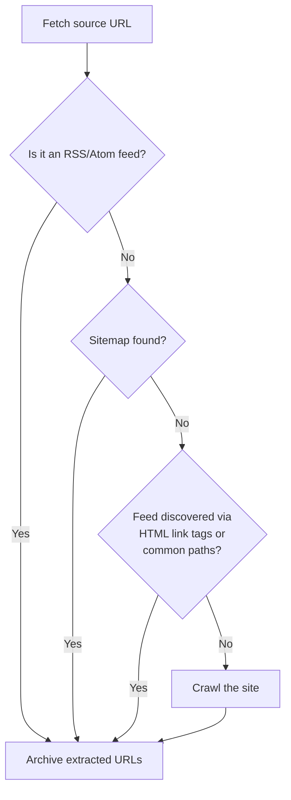

# WaybackArchiver

Post URLs to the [Wayback Machine](https://archive.org/web/) (Internet Archive) using the [SPN2 API](https://docs.google.com/document/d/1Nsv52MvSjbLb2PCpHlat0gkzw0EvtSgpKHu4mk0MnrA/edit). Discover URLs via crawler, [Sitemap(s)](http://www.sitemaps.org), RSS/Atom feeds, or provide them directly.

[](https://github.com/buren/wayback_archiver/actions/workflows/ci.yml) [](http://badge.fury.io/rb/wayback_archiver)

## Installation

```
gem install wayback_archiver
```

Or add to your Gemfile:

```ruby
gem 'wayback_archiver'
```

Requires Ruby >= 3.1.

## Usage

### Ruby

```ruby
require 'wayback_archiver'

# Auto (default) - see "Auto discovery" section below
WaybackArchiver.archive('example.com')

# Crawl - spider the site for URLs
WaybackArchiver.archive('example.com', strategy: :crawl)

# Sitemap - parse sitemap XML (supports index files and gzip)
WaybackArchiver.archive('example.com/sitemap.xml', strategy: :sitemap)

# RSS/Atom feed - extract URLs from a feed
WaybackArchiver.archive('example.com/feed.xml', strategy: :rss)

# Single URL or multiple URLs
WaybackArchiver.archive('example.com', strategy: :url)
WaybackArchiver.archive(%w[example.com www.example.com], strategy: :urls)

# Limit concurrency and total URLs
WaybackArchiver.archive('example.com', concurrency: 10, limit: 100)
```

**SPN2 capture options:**

```ruby
# Common options
WaybackArchiver.archive('example.com',
  capture_all: true,            # capture error pages (4xx/5xx)
  capture_screenshot: true,     # generate full-page PNG screenshot
  skip_first_archive: true,     # skip duplicate check (faster)
  if_not_archived_within: '3d'  # skip if archived within 3 days
)

# Advanced options
WaybackArchiver.archive('example.com',
  capture_outlinks: true,          # auto-capture up to 100 linked pages (requires auth)
  screenshot_dir: './screenshots', # save screenshots locally (requires auth)
  js_behavior_timeout: 10,        # run JS for N seconds after page load (max 30, default 5)
  force_get: true,                 # force HTTP GET instead of HEAD+browser
  use_user_agent: 'MyBot/1.0',    # custom User-Agent for target page
  delay_wb_availability: true      # delay public availability ~12h
)
```

**Processing results:**

Each strategy returns an array of results and accepts a block:

```ruby
results = WaybackArchiver.archive('example.com') do |result|
  if result.success?
    puts "Archived: #{result.wayback_url}"
  else
    puts "Failed: #{result.uri} - #{result.status_ext}"
  end
end

results.select(&:success?).each do |r|
  puts "#{r.uri} => #{r.wayback_url} (#{r.duration_sec}s)"
end
```

### CLI

```bash
# Auto (default)
wayback_archiver example.com

# With auth and SPN2 options
wayback_archiver example.com --access-key=KEY --secret-key=SECRET \
  --capture-screenshot --screenshot-dir=./screenshots

# Crawl with concurrency
wayback_archiver example.com --crawl --concurrency=8

# RSS/Atom feed
wayback_archiver example.com/feed.xml --rss

# Multiple URLs
wayback_archiver example.com www.example.com --urls

# Sitemap
wayback_archiver example.com/sitemap.xml --sitemap

# Kitchen sink
wayback_archiver example.com --concurrency=10 --limit=100 --capture-all --verbose
```

Run `wayback_archiver --help` for all options.

**View your archives:** [web.archive.org/web/*/http://example.com](https://web.archive.org/web/*/http://example.com)

## Configuration

### Authentication

WaybackArchiver works without authentication, but with lower rate limits (4 captures/min, 4,000/day). For full access (12 captures/min, 100,000/day) and features like screenshot download and outlink capture, get your API keys at [archive.org/account/s3.php](https://archive.org/account/s3.php).

**Environment variables** (recommended):

```bash
export WAYBACK_ACCESS_KEY="your-access-key"
export WAYBACK_SECRET_KEY="your-secret-key"
```

Also supports `IA_S3_ACCESS_KEY` / `IA_S3_SECRET_KEY` for compatibility with other Internet Archive tools.

### Options

```ruby
WaybackArchiver.configure do |config|
  config.access_key = 'your-access-key'
  config.secret_key = 'your-secret-key'
  config.concurrency = 8
  config.max_limit = 500
  config.user_agent = 'MyApp/1.0'
  config.respect_robots_txt = false
  config.logger = Logger.new(STDOUT)
end
```

Individual setters also work:

```ruby
WaybackArchiver.concurrency = 4
WaybackArchiver.logger = Rails.logger
```

By default `wayback_archiver` doesn't respect robots.txt files. See [this Internet Archive blog post](https://blog.archive.org/2017/04/17/robots-txt-meant-for-search-engines-dont-work-well-for-web-archives/) for more information.

### Custom adapter

The adapter handles how URLs are sent to the archive. Any object responding to `#call` works:

```ruby
WaybackArchiver.adapter = ->(url) { puts url }
```

## Auto discovery

The default `:auto` strategy tries multiple discovery methods in order, using the first one that finds URLs:



1. **Direct feed detection** -- fetches the source URL and checks if it is itself an RSS or Atom feed
2. **Sitemap discovery** -- looks for sitemaps via `robots.txt` and common sitemap paths
3. **Feed autodiscovery** -- looks for `<link>` tags with `type="application/rss+xml"` or `type="application/atom+xml"` in the page HTML, then falls back to probing common feed paths (`/feed`, `/feed.xml`, `/rss.xml`, `/atom.xml`, `/index.xml`)
4. **Crawl** -- spiders the site following same-domain links

This means pointing WaybackArchiver at a blog with an RSS feed will automatically find and archive all posts without needing to specify a strategy.

## Migrating from v1.x

v2.0 uses the SPN2 API, replacing the old fire-and-forget SPN1 approach. Captures are now submitted asynchronously and polled for completion (handled transparently by the gem).

**Key changes:**

- **Authentication supported** via S3 API keys for higher rate limits and features like screenshots and outlinks
- **All results returned** including failures (v1 silently dropped errors):
  ```ruby
  # v1: results only contained successes
  # v2: results contain everything, filter with:
  results.select(&:success?)
  ```
- **Rich result objects** with SPN2 fields (`job_id`, `timestamp`, `wayback_url`, `duration_sec`, `resources`, `outlinks`, `screenshot_url`, `status_ext`)
- **Default concurrency** changed from 1 to 4
- **Ruby >= 3.1** required (was >= 2.0)
- **CI moved** from Travis CI to GitHub Actions
- **SSL verification** enabled by default

The public API (`archive`, `crawl`, `sitemap`, `urls`) is unchanged. v2 also adds an `rss` strategy for archiving URLs from RSS/Atom feeds. Existing code that calls `WaybackArchiver.archive(url, strategy: :auto)` will continue to work.

## Docs

[RubyDoc](http://www.rubydoc.info/github/buren/wayback_archiver/master)

```bash
yard # generates documentation to doc/
```

## Contributing

Contributions, feedback and suggestions are very welcome.

1. Fork it
2. Create your feature branch (`git checkout -b my-new-feature`)
3. Commit your changes (`git commit -am 'Add some feature'`)
4. Push to the branch (`git push origin my-new-feature`)
5. Create new Pull Request

## License

[MIT License](LICENSE)

## References

- [Wayback Machine](https://archive.org/web/)
- [SPN2 API docs](https://docs.google.com/document/d/1Nsv52MvSjbLb2PCpHlat0gkzw0EvtSgpKHu4mk0MnrA/edit)
- [sitemaps.org](http://www.sitemaps.org)
- [robotstxt.org](http://www.robotstxt.org/robotstxt.html)
