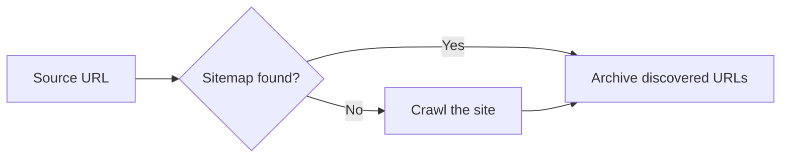

# WaybackArchiver

Post URLs to the [Wayback Machine](https://archive.org/web/) (Internet Archive) using the [SPN2 API](https://docs.google.com/document/d/1Nsv52MvSjbLb2PCpHlat0gkzw0EvtSgpKHu4mk0MnrA/edit). Discover URLs via crawler, [Sitemap(s)](http://www.sitemaps.org), RSS/Atom feeds, or provide them directly.

[](https://github.com/buren/wayback_archiver/actions/workflows/ci.yml) [](http://badge.fury.io/rb/wayback_archiver)

## Installation

```
gem install wayback_archiver
```

Or add to your Gemfile:

```ruby
gem 'wayback_archiver'
```

Requires Ruby >= 3.1.

## Usage

### Ruby

```ruby
require 'wayback_archiver'

# Auto (default) - see "Auto discovery" section below
WaybackArchiver.archive('example.com')

# Crawl - spider the site for URLs
WaybackArchiver.archive('example.com', strategy: :crawl)

# Sitemap - parse sitemap XML (supports index files and gzip)
WaybackArchiver.archive('example.com/sitemap.xml', strategy: :sitemap)

# RSS/Atom feed - extract URLs from a feed
WaybackArchiver.archive('example.com/feed.xml', strategy: :rss)

# Single URL or multiple URLs
WaybackArchiver.archive('example.com', strategy: :url)
WaybackArchiver.archive(%w[example.com www.example.com], strategy: :urls)

# Crawl across subdomains (strings or regex patterns)
WaybackArchiver.archive('www.example.com', strategy: :crawl,
  hosts: [/.*\.example\.com/])

# Limit concurrency and total URLs
WaybackArchiver.archive('example.com', concurrency: 10, limit: 100)

# Filter by file extension
WaybackArchiver.archive('example.com', strategy: :crawl,
  include_ext: %w[html pdf])  # only archive these extensions
WaybackArchiver.archive('example.com', strategy: :crawl,
  exclude_ext: %w[zip png jpg])  # skip these extensions
```

**SPN2 capture options:**

```ruby
# Common options
WaybackArchiver.archive('example.com',
  capture_all: true,            # capture error pages (4xx/5xx)
  capture_screenshot: true,     # generate full-page PNG screenshot
  skip_first_archive: true,     # skip duplicate check (faster)
  if_not_archived_within: '3d'  # skip if archived within 3 days
)

# Advanced options
WaybackArchiver.archive('example.com',
  capture_outlinks: true,          # auto-capture up to 100 linked pages (requires auth)
  screenshot_dir: './screenshots', # save screenshots locally (requires auth)
  js_behavior_timeout: 10,         # run JS for N seconds after page load (max 30, default 5)
  force_get: true,                 # force HTTP GET instead of HEAD+browser
  use_user_agent: 'MyBot/1.0',     # custom User-Agent for target page
  delay_wb_availability: true      # delay public availability ~12h
)
```

**Processing results:**

Each strategy returns an array of results and accepts a block. The block is
called when a URL is accepted by SPN2 (an interim result where
`result.submitted?` is true) and again with the final result once the capture
completes — guard with `submitted?` if you only want final results. It may be
called from multiple threads.

```ruby
results = WaybackArchiver.archive('example.com') do |result|
  next if result.submitted? # interim notification — final result comes later

  if result.success?
    puts "Archived: #{result.wayback_url}"
  else
    puts "Failed: #{result.uri} - #{result.status_ext}"
  end
end

results.select(&:success?).each do |r|
  puts "#{r.uri} => #{r.wayback_url} (#{r.duration_sec}s)"
end
```

See the [examples/](examples/) directory for more detailed, runnable scripts.

### CLI

```bash
# Auto (default)
wayback_archiver example.com

# With auth and SPN2 options
wayback_archiver example.com --access-key=KEY --secret-key=SECRET \
  --capture-screenshot --screenshot-dir=./screenshots

# Crawl with concurrency
wayback_archiver example.com --crawl --concurrency=8

# Crawl across subdomains
wayback_archiver www.example.com --crawl --hosts=www.example.com,blog.example.com

# Crawl with regex host pattern
wayback_archiver www.example.com --crawl --hosts=.*.example.com

# RSS/Atom feed
wayback_archiver example.com/feed.xml --rss

# Multiple URLs
wayback_archiver example.com www.example.com --urls

# Sitemap
wayback_archiver example.com/sitemap.xml --sitemap

# Read URLs from a file (one per line, # comments, - for stdin)
wayback_archiver --file=urls.txt
cat urls.txt | wayback_archiver --file=-

# Discover URLs without archiving (pipe-friendly, one per line)
wayback_archiver example.com --list-urls
wayback_archiver example.com --crawl --list-urls --exclude-ext=png,jpg > urls.txt

# Check which URLs are already archived (no archiving)
wayback_archiver example.com --check

# Skip URLs already archived within the last 7 days
wayback_archiver example.com --skip-archived=7d

# Filter by file extension
wayback_archiver example.com --crawl --include-ext=html,pdf
wayback_archiver example.com --crawl --exclude-ext=zip,png,jpg

# Skip URLs matching regex patterns
wayback_archiver example.com --crawl --skip-patterns='hs_amp=true,/tag/'

# Disable duplicate content detection (on by default for crawl)
wayback_archiver example.com --crawl --no-skip-duplicates

# Check SPN2 system and user status
wayback_archiver --status --access-key=KEY --secret-key=SECRET

# Resumable session (auto-saves progress, resumes on re-run)
wayback_archiver example.com --session=session.jsonl
wayback_archiver --resume=session.jsonl

# Write results to CSV or JSON report
wayback_archiver example.com --report=results.csv
wayback_archiver example.com --report=results.json

# Quiet mode (suppress logs) with summary
wayback_archiver example.com --quiet

# Kitchen sink
wayback_archiver example.com --concurrency=10 --limit=100 --capture-all --verbose
```

Run `wayback_archiver --help` for all options.

**View your archives:** [web.archive.org/web/*/http://example.com](https://web.archive.org/web/*/http://example.com)

## Configuration

### Authentication

The Wayback Machine SPN2 API requires authentication. Get your API keys at [archive.org/account/s3.php](https://archive.org/account/s3.php).

**Environment variables** (recommended):

```bash
export WAYBACK_ACCESS_KEY="your-access-key"
export WAYBACK_SECRET_KEY="your-secret-key"
```

Also supports `IA_S3_ACCESS_KEY` / `IA_S3_SECRET_KEY` for compatibility with other Internet Archive tools.

### Options

```ruby
WaybackArchiver.configure do |config|
  config.access_key = 'your-access-key'
  config.secret_key = 'your-secret-key'
  config.concurrency = 8
  config.max_limit = 500
  config.user_agent = 'MyApp/1.0'
  config.respect_robots_txt = false
  config.logger = Logger.new(STDOUT)
end
```

Individual setters also work:

```ruby
WaybackArchiver.config.concurrency = 4
WaybackArchiver.config.logger = Rails.logger
```

By default `wayback_archiver` doesn't respect robots.txt files. See [this Internet Archive blog post](https://blog.archive.org/2017/04/17/robots-txt-meant-for-search-engines-dont-work-well-for-web-archives/) for more information.

### Event listener

Subscribe to lifecycle events for progress reporting, logging, or custom integrations:

```ruby
# Subclass NullListener and override the events you care about
class MyListener < WaybackArchiver::NullListener
  def on_resolved(strategy:, url_count:, source:)
    puts "Strategy: #{strategy} (#{url_count} URLs)"
  end

  def on_completed(result:)
    puts "#{result.status_label}  #{result.uri}" unless result.submitted?
  end
end

WaybackArchiver.config.listener = MyListener.new
```

Or use a hash of procs for quick one-offs:

```ruby
WaybackArchiver.config.listener = {
  on_completed: ->(result:) { puts result.uri if result.success? }
}
```

Any object works — only implement the methods you need. Unimplemented events are silently skipped.

**Available events:**

| Event | When | Keywords |
|-------|------|----------|
| `on_resolved` | Strategy determined, URL count known | `strategy:, url_count:, source:` |
| `on_batch_start` | Batch archiving begins | `total:` (`nil` during streaming crawl) |
| `on_url_discovered` | URL found during crawl (crawl strategy only) | `url:, count:` |
| `on_crawl_complete` | Crawler finished discovering URLs | `url_count:` |
| `on_duplicate_skipped` | URL skipped as duplicate content (crawl only) | `url:` |
| `on_submitted` | URL submitted to SPN2 | `url:, job_id:` |
| `on_completed` | URL finished (success, cached, error) | `result:` |
| `on_progress` | After each poll cycle | `captured:, failed:, pending:` |
| `on_waiting_for_slots` | Waiting for available capture slots | `processing:` |

See [examples/event_listener.rb](examples/event_listener.rb) for more patterns.

## Auto discovery

The default `:auto` strategy tries multiple discovery methods in order, using the first one that finds URLs:



1. **Sitemap discovery** -- looks for sitemaps via `robots.txt` and common sitemap paths
2. **Crawl** -- spiders the site following same-domain links

RSS/Atom feeds are intentionally excluded from auto discovery — feeds typically contain only recent posts, not a comprehensive list of site URLs. Use `strategy: :rss` explicitly when you want to archive feed URLs.

## Migrating from v1.x

> **:warning: Authentication is now required.** The Wayback Machine SPN2 API no longer allows anonymous access. You must set `WAYBACK_ACCESS_KEY` and `WAYBACK_SECRET_KEY` before archiving. Get your keys at [archive.org/account/s3.php](https://archive.org/account/s3.php).

v2.0 uses the SPN2 API, replacing the old fire-and-forget SPN1 approach. Captures are now submitted asynchronously and polled for completion (handled transparently by the gem).

**Key changes:**

- **Authentication required** — S3 API keys must be configured for archiving (read-only operations like `--check` still work without credentials)
- **All results returned** including failures (v1 silently dropped errors):
  ```ruby
  # v1: results only contained successes
  # v2: results contain everything, filter with:
  results.select(&:success?)
  ```
- **Rich result objects** with SPN2 fields (`job_id`, `timestamp`, `wayback_url`, `duration_sec`, `resources`, `outlinks`, `screenshot_url`, `status_ext`)
- **Default concurrency** changed from 1 to 4
- **`:auto` strategy enhanced** — now checks for sitemaps before falling back to crawling (use `strategy: :rss` for feed-based archiving)
- **New CLI features** — `--check`, `--skip-archived`, `--file`, `--session`/`--resume`, `--report`, `--status`, `--include-ext`/`--exclude-ext`
- **Ruby >= 3.1** required (was >= 2.0)
- **CI moved** from Travis CI to GitHub Actions
- **SSL verification** enabled by default
- **Configuration moved to `WaybackArchiver.config`** — settings like `concurrency`, `adapter`, `access_key` etc. are now accessed via `WaybackArchiver.config.concurrency` instead of `WaybackArchiver.concurrency`. The `configure` block is unchanged. `WaybackArchiver.logger` and `WaybackArchiver.listener` remain available as convenience getters.

The public API (`archive`, `crawl`, `sitemap`, `urls`) is unchanged. Existing code that calls `WaybackArchiver.archive(url, strategy: :auto)` will continue to work — see [Auto discovery](#auto-discovery) for the updated behavior. See the [CHANGELOG](CHANGELOG.md) for all new features.

## Docs

[RubyDoc](http://www.rubydoc.info/github/buren/wayback_archiver/master)

### Public API

The supported public API is: the `WaybackArchiver` module methods
(`archive`, `crawl`, `sitemap`, `rss`, `urls`, `check`, `discover_urls`,
`configure`, `config`), `Configuration`, `Archive`, `ArchiveResult`,
`CheckResult`, `ErrorCodes`, and the listener classes
(`NullListener`, `ListenerProxy`). These follow semantic versioning.

Everything else (classes tagged `@api private` — HTTP plumbing, the batch
submitter, discovery internals, the CLI implementation) is internal and may
change in any release.

```bash
yard # generates documentation to doc/
```

## Contributing

Contributions, feedback and suggestions are very welcome.

1. Fork it
2. Create your feature branch (`git checkout -b my-new-feature`)
3. Commit your changes (`git commit -am 'Add some feature'`)
4. Push to the branch (`git push origin my-new-feature`)
5. Create new Pull Request

## License

[MIT License](LICENSE)

## References

- [Wayback Machine](https://archive.org/web/)
- [SPN2 API docs](https://docs.google.com/document/d/1Nsv52MvSjbLb2PCpHlat0gkzw0EvtSgpKHu4mk0MnrA/edit)
- [sitemaps.org](http://www.sitemaps.org)
- [robotstxt.org](http://www.robotstxt.org/robotstxt.html)

## Alternatives

- [Save Page Now for Google Sheets](https://archive.org/services/wayback-gsheets/) — Internet Archive's Google Sheets integration for archiving pages
- [wayback-machine-spn-scripts](https://github.com/overcast07/wayback-machine-spn-scripts) — Bash scripts for SPN2 with auth, outlinks, rate limiting, and resumable sessions
- [wayback-machine-archiver](https://github.com/agude/wayback-machine-archiver) — Python CLI using SPN2 with sitemaps, screenshots, and outlinks
- [savepagenow](https://github.com/palewire/savepagenow) — Python package with library and CLI interface
- [spn2](https://gitlab.com/matzfan/spn2) — Ruby gem for the SPN2 REST API with job status tracking and outlink capture
- [internetarchive](https://github.com/jjjake/internetarchive) — Python CLI and library for interacting with Internet Archive (uploads, metadata, search)
- [Internet Archive S3-like API](https://archive.org/developers/ias3.html) — official docs for the S3-compatible API used for uploads and item management
